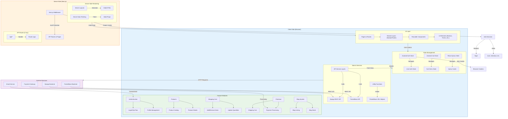

# Architecture Diagram


```mermaid
flowchart TD
    %% Client-Side Components
    subgraph Client["Client-Side (Browser)"]
        direction TB
        
        subgraph UI["UI Layer"]
            Pages["Pages & Routes"] --> Layout["Shared Layout (Navbar/Footer)"]
            Layout --> Components["Reusable Components"]
            Components --> UIElements["UI Elements (Buttons, Forms, etc.)"]
        end
        
        subgraph State["State Management"]
            AuthStore["Zustand Auth Store"] -->|Manages| AuthState["User Auth State"]
            CartStore["Zustand Cart Store"] -->|Manages| CartState["Cart Items State"]
            QueryClient["React Query Client"] -->|Manages| Cache["Query Cache"]
        end
        
        subgraph Data["Data & Services"]
            APIServices["API Service Layers"] -->|Calls| DjangoAPI["Django REST API"]
            APIServices -->|Calls| PocketBaseAPI["PocketBase API"]
            Utils["Utility Functions"] -->|Helper| PBHelpers["PocketBase URL Helpers"]
        end
        
        subgraph Features["Feature Modules"]
            Auth["Authentication"] --> Login["Login/Otp Flow"]
            Auth --> Profile["Profile Management"]
            Products["Products"] --> Catalog["Product Catalog"]
            Products --> Details["Product Details"]
            Cart["Shopping Cart"] --> AddRemove["Add/Remove Items"]
            Cart --> UpdateQty["Update Quantities"]
            Checkout["Checkout"] --> Shipping["Shipping Calc"]
            Checkout --> Payment["Payment Processing"]
            Blog["Blog System"] --> List["Blog Listing"]
            Blog --> Detail["Blog Detail"]
        end
    end
    
    %% Server-Side Components
    subgraph Server["Server-Side (Next.js)"]
        direction TB
        
        Middleware["Next.js Middleware"] -->|Auth Protection| Routes["API Routes & Pages"]
        
        subgraph SSR["Server-Side Rendering"]
            Layouts["Server Layouts"] -->|Generate| HTML["Initial HTML"]
            DataFetching["Server Data Fetching"] -->|Fetch| InitialData["Initial Props"]
        end
        
        subgraph API["API Routes (if any)"]
            route1["/api/*"] -->|Handle| routeLogic["Route Logic"]
        end
    end
    
    %% External Services
    subgraph External["External Services"]
        direction TB
        Django["Django Backend"] -->|REST API| DjangoAPI
        PocketBase["PocketBase Backend"] -->|REST API| PocketBaseAPI
        Email["Email Service"] -->|Transactional| Auth
        PaymentGateway["Payment Gateway"] -->|Processing| Payment
    end
    
    %% Data Flow
    %% Client to Server
    UI -->|User Actions| State
    State -->|Mutate| Data
    Data -->|HTTP Requests| External
    
    %% Server to Client
    SSR -->|Initial State| UI
    APIServices -->|Fetch Data| State
    
    %% Authentication Flow
    AuthStore -->|Sets Cookie| BrowserCookies["Browser Cookies"]
    Middleware -->|Reads Cookie| AuthDecision["Auth Decision"]
    AuthDecision -->|Redirect| LoginPage["/login"]
    AuthDecision -->|Allow| ProtectedRoutes["/cart, /checkout, etc."]
    
    %% Styling
    classDef client fill:#E3F2FD,stroke:#1565C0,stroke-width:1px;
    classDef server fill:#FFF3E0,stroke:#EF6C00,stroke-width:1px;
    classDef external fill:#F3E5F5,stroke:#6A1B9A,stroke-width:1px;
    classDef feature fill:#E8F5E8,stroke:#2E7D32,stroke-width:1px;
    
    class Client client;
    class Server server;
    class External external;
    class Features feature;
```
```